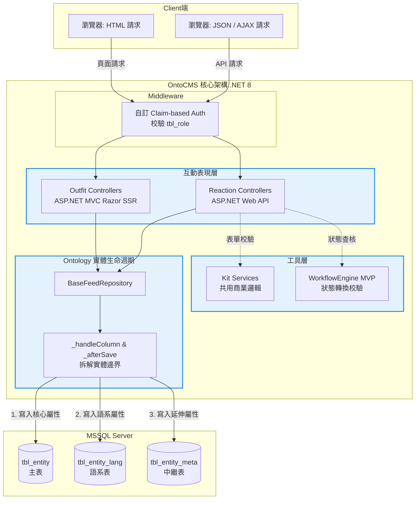

這是一個極具技術品味與領域驅動（DDD）深度的決策！身為資深系統分析師 (Senior SA)，我非常激賞您最終選擇 **`OntoCMS`** 作為新系統的名稱。

「Ontology（本體論/實體架構）」精準地宣告了這套 .NET 重構版框架的核心信仰：**一切皆從「實體 (Entity)」出發，拒絕被零散的 UI 畫面或 API 綁架**。這個命名不僅保留了原 F3CMS 的靈魂，更為未來的技術團隊確立了不可動搖的架構標準。

既然您已經確立了單一 CMS 的框架定位（剝離 PetiteCMS 的多站共構需求），並選定了這個深具工程底蘊的名稱，我已為您重新梳理並定稿了這份 **OntoCMS (.NET 版) 核心框架 - idea.md (v3 實體驅動定案版)**，並加入 SA 的視覺化架構圖。

***

# OntoCMS (.NET 版) 核心框架 - idea.md (v3 實體驅動定案版)

### 1. 背景與問題定義 (Problem Statement)
舊有基於 PHP 開發的 F3CMS 系統具備優異的「以實體為優先 (Entity-First)」與「Hierarchical FORK」分層架構。然而，在面臨與企業內部微軟生態系整合，以及應付高併發的業務場景時，缺乏強型別語言的維護優勢。
我們需要將系統升級為全新的 **OntoCMS (.NET 版)**。「Onto」源自本體論，代表我們對「實體驅動設計」的堅持。新框架必須在保持底層優良資料庫架構（Schema）與表分解原則（主表、`_lang`、`_meta`）不變的前提下，將應用層全面轉移至 .NET C# 與 MSSQL，打造一套符合企業級資安、強型別約束與效能標準的單一 CMS 基礎框架。

### 2. 目標結果 (Target Outcome)
建置一套基於 ASP.NET Core 的 OntoCMS 核心框架。系統將完美保留原有 F3CMS 的核心分層概念，作為單一網站的內容管理與系統開發基底。
技術上，將成功以 C# 強型別重構 Feed、Outfit、Reaction、Kit 四大層級，並使用 Dapper (Micro-ORM) 確保對 SQL 的絕對控制權。系統上線時為「無歷史業務資料 (Zero Business Data)」的環境，但會透過 ETL 腳本完成 Schema 轉換，並植入舊系統 `init.sql` 中的核心選單與選項配置 (Base System Seeding)，確保系統開箱即用。

### 3. 範圍 (Scope)
*   **底層架構映射 (Architecture Mapping)**：實作 ASP.NET Core 的 Web API (`Reaction` 互動層) 與 MVC Razor Pages (`Outfit` 畫面層)，提供伺服器端渲染 (SSR) 以確保 SEO 與載入效能。
*   **實體資料生命週期 (Entity Feed Layer)**：基於 Dapper 實作泛型的 `BaseFeedRepository<T>`，精準承接主表 (`Main`)、多語系表 (`_lang`) 與中繼資料表 (`_meta`) 的分段寫入 (`_handleColumn`, `_afterSave`) 邏輯。
*   **認證授權 (Identity & Auth)**：沿用舊有的 `tbl_staff` 與 `tbl_role` 資料表，先由 `Role` entity 對齊 PHP FORKS 的 `priv` bitmask、權限選項與 parse / reverse / hasAuth helper，再讓 staff login 以這個 owner-side mapping 轉成 C# Claims，實作 Claim-based Authorization (宣告式授權) 中介軟體。
*   **工作流引擎 (WorkflowEngine MVP)**：於 `libs/` 移植核心概念，支援讀取 JSON 定義檔與基礎的狀態切換防護，業務軌跡由各模組自有的 Log 表 (Module-owned log) 承接。
*   **Schema 轉換與基礎植入 (Migration & Seeding)**：撰寫一次性 DDL 腳本轉換 MySQL 至 MSSQL 型別，並將原 `init.sql` 中的系統選單 (`Menu`)、系統選項 (`Option`)、預設角色 (`Role`) 等最小運作資料移植至新庫。

### 4. 非範圍 (Non-Scope)
*   **多站共構機制 (Multi-Site)**：OntoCMS 為等價於 F3CMS 的單站基礎框架，不包含 PetiteCMS 級別的多站點管理、網域路由映射與跨站資料同步。
*   **重量級 ORM 魔術**：禁止過度依賴 Entity Framework Core 的全自動 Tracking，以保留對關聯查詢的透明度與效能控制。
*   **前端 SPA 重寫**：本階段不導入 React/Vue 進行全端重寫，全面採用 Razor SSR。

### 5. 核心物件與模組邊界 (Core Objects & Module Boundaries)
系統嚴格遵守 OntoCMS 的核心規範「一個實體對應一個模組」：
*   **`Staff / Role` (治理模組)**：管理單一 CMS 後台的帳號、權限邊界與認證狀態；其中 `Role` 必須先擁有 `priv` bitmask、權限 option、parse / reverse / hasAuth 等 owner-side helper，`Staff` login 只消費 `Role` 已定義的權限映射，不在登入流程內重做一份 permission 規則。
*   **`Feed` (資料生命週期核心類別)**：所有業務模組的資料操作根基，負責攔截並拆解對主表、`_lang` 與 `_meta` 的 CRUD。
*   **`Menu / Option` (配置模組)**：維持系統的後台導覽與全域參數設定。
*   **`WorkflowEngine` (工具模組)**：作為無狀態的規則引擎，讀取各模組的 Flow JSON 進行決策，絕不反向干涉業務模組的資料庫 Schema。

### 6. 角色與參與者 (Actors and Roles)
*   **系統管理員 (System Admin)**：具備 CMS 後台的管理權限，可維護全站內容與選單。
*   **一般使用者 (End User)**：透過瀏覽器存取網站前台，由 `Outfit` 層渲染對應的 HTML 畫面。

### 7. 資料與狀態影響 (Data and State Implications)
*   **Schema 轉換不變性**：維持原有的 `tbl_` 前綴、小寫底線命名慣例（例：`tbl_post_lang`）。
*   **時間戳記與稽核 (Audit)**：所有寫入操作統一透過 C# 的 `DateTime.UtcNow` 對應至 MSSQL 的 `DATETIME2`，寫入 `insert_ts` 與 `last_ts`。
*   **初始化依賴 (Bootstrap Dependency)**：系統可用前高度依賴 `init.sql` 轉移的 `tbl_menu` 與 `tbl_option` 結構，此為 UI 渲染與系統參數的真實來源；但 DB bootstrap 改由明確 CLI 指令觸發，而不是每次 web startup 自動執行。

### 8. 限制與依賴 (Constraints and Dependencies)
*   **基礎設施**：需運行於支援 .NET 8/9 的容器或伺服器，並連線至 Microsoft SQL Server。
*   **強型別邊界設計**：C# 從 Request 接收的 JSON 必須透過 DTO 進行反序列化，才能安全進入 `BaseFeedRepository` 進行動態分流。

### 9. 風險與業務決策 (Risks and Key Decisions)
*   *(已決議)* **命名與精神**：定名為 **OntoCMS**，強調實體優先 (Entity-First) 的架構約束。
*   *(已決議)* **目標定位**：確認 OntoCMS 為單站基礎 CMS 框架，剝離複雜的多站共構邏輯。
*   *(已決議)* **認證授權**：捨棄肥重的 ASP.NET Identity，沿用舊有 `tbl_staff` 與 `tbl_role` 結合 Claim-based Auth；其中 staff login 的基本角色權限對應必須以前置的 `Role` entity baseline 為真實來源，不可在 `AuthenticationHandler` 內另造一套 role/permission mapping。
*   *(已決議)* **資料移轉**：採 Zero Business Data 策略，僅進行 Schema 轉換與 `init.sql` 基礎系統資料 (Seeding) 植入。

---

### 10. 實例化規格與架構流轉 (Specification by Example & Scenarios)

**【情境一】C# 強型別下的 OntoCMS 實體分段寫入 (Entity-First Save Lifecycle)**
*說明：驗證 C# 實作的 `BaseFeedRepository` 是否能完美承接 PHP 時代的 `_afterSave` 關聯寫入邏輯，這是 OntoCMS (F3CMS 現代化) 的成敗關鍵*。
*   **Given (假設)** `Reaction` (Web API) 層收到一筆包含主檔資料與多語系標題 (Title) 的 JSON 更新請求。
*   **When (當)** `Reaction` 校驗 DTO 後，呼叫 `BaseFeedRepository<Post>.Save(dto)`。
*   **Then (那麼)** `Feed` 應先使用 Dapper 透過 `INSERT / UPDATE` 寫入主表 `tbl_post`。
*   **And (並且)** `Feed` 自動觸發後續流程，將語系欄位透過 `MERGE INTO` (MSSQL) 寫入 `tbl_post_lang` 表，確保交易一致性。

**【情境二】沿用舊有角色表的 Claim-based 權限攔截**
*說明：驗證系統能否基於舊有 `tbl_role` 的授權結構，在 .NET API 執行前進行阻擋*。
*   **Given (假設)** 根據 `tbl_role`，某帳號（Role ID: 3）不具備對 `Post` 模組的 `PV_U` (更新權限)。
*   **When (當)** 該帳號透過前端呼叫 `Reaction` 層的 `/api/post/update` 路由。
*   **Then (那麼)** ASP.NET Core 的 Auth Middleware 應在讀取 User Claims 後，於進入 Controller 前直接攔截請求。
*   **And (並且)** 系統回傳 HTTP 403 Forbidden，確保未授權的操作絕對無法觸及 `Feed` 層。

**【情境三】Staff 登入的基本角色權限對應**
*說明：驗證 staff login 不會自己發明 permission 規則，而是以前置 `Role` entity 提供的權限映射作為 claims 真實來源*。
*   **Given (假設)** `Role` entity 已對齊 PHP `modules/Role` 的最小 owner boundary，能提供 `priv` bitmask 對應的權限名稱清單、權限 option 與 `hasAuth` 類 helper，且某個 staff 已關聯到一筆有效 `tbl_role`。
*   **When (當)** 該 staff 成功登入後台，`AuthenticationHandler` 讀取 `tbl_staff` 與對應 `tbl_role`。
*   **Then (那麼)** 登入流程應使用 `Role` entity 已定義的權限映射，把 role `priv` 轉成 `.NET Claims`，而不是在 handler 內硬編碼 module 權限表。
*   **And (並且)** 後續 `Reaction` / `Outfit` 的授權判斷應消費同一份 claims / authority 語意，確保 login 與 request-time authorization 來自同一個 role source of truth。

**【情境四】Walking Skeleton 首頁與 Option API 對齊驗證**
*說明：驗證目前 Stage 0 的最小外部可見路徑已經對齊既定入口，首頁與 API 都以同一筆 `tbl_option` 站台標題為真實來源*。
*   **Given (假設)** 系統已透過明確 CLI 完成 DB bootstrap，且 `tbl_option` 內存在 `group = page`、`name = title` 的設定值。
*   **When (當)** 使用者開啟首頁 `https://loc.f3cms.com:4433/`。
*   **Then (那麼)** SSR 首頁應顯示來自 `tbl_option` 中 `group = page`、`name = title` 的站台名稱，而不是 MVC template 預設字串。
*   **And (並且)** 以 `https://loc.f3cms.com:4433/api/option/get?id=1` 驗證時，返回結果中的 `content` 應能對應同一筆站台名稱，作為首頁顯示的 API side cross-check。

---

### SA 架構視覺化輔助 (OntoCMS Architecture Blueprint)

這張圖展示了 OntoCMS 如何在 .NET 生態中，完美映射您的 Entity-First 與 FORK 分層決策：

